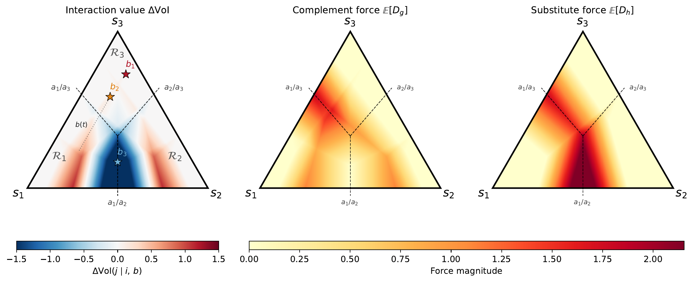

# All Substitution Is Local

When does learning from one source make a second source more valuable, and when does it make it redundant?

We show the answer is geometric: information sources compete only when observations cross the boundaries where decisions change. We decompose the interaction between sources into two opposing forces, one that complements and one that substitutes, and prove that substitution is impossible unless an observation crosses a decision boundary.

The complement force and substitute force are present everywhere on the belief simplex, but the substitute force can only dominate near decision boundaries. In the interior of any decision region, information sources always cooperate.

## Paper

See `paper/` for the full paper source.

## Formal proofs

Lean 4 mechanized proofs are in `lean/`.
